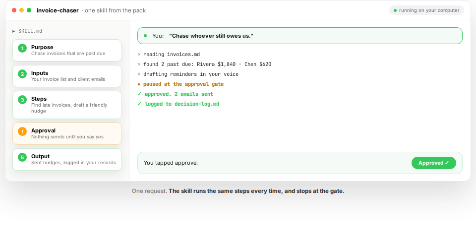

> Moved: these skills now ship inside [MeshVault Harness](https://github.com/thefiredev-cloud/meshvault-harness), a one-command installer for Hermes, OMP, a local model and these nine skills plus two new ones (`harness-doctor`, `local-model-prompting`). This repo stays up for existing links. New work happens in the harness.

# MeshVault Skills Starter

[](https://github.com/thefiredev-cloud/meshvault-skills-starter/actions/workflows/validate.yml)

Nine free, MIT-licensed agent skills for small-business admin work: chasing invoices, drafting quotes, filing receipts, triaging email, and prepping meetings. Each skill is one plain Markdown `SKILL.md` file that Claude Code, Codex, or any agent that loads skill folders can use. Every skill tells the agent to stop and wait for a person before it sends, pays, posts, moves files, or deletes.

- Who it is for: people who already run an AI agent with access to their own email, calendar, or files, and want written rules they can read and edit before the agent acts.
- What it needs: an agent runtime that loads `SKILL.md` folders, plus that agent's own tools for mail, calendars, and spreadsheets. The skills ship no connectors.
- What it does not do: there is no code, no installer script, and no enforcement. The approval gate is an instruction to the model, not a technical block. An agent that has send access and ignores the skill can still send. See [SECURITY.md](SECURITY.md).
- Maturity: all nine skills are at version `1.0.0`. CI checks on every push that each skill has `name`, `description`, `license: MIT`, and an `## Approval Gate` section. Active development moved to the harness.



[MeshVault](https://meshvault.ai?utm_source=github&utm_medium=readme&utm_campaign=skills-starter) · [The $49 skills pack](https://meshvault.ai/skills?utm_source=github&utm_medium=readme&utm_campaign=skills-starter) · [Facts file for AI agents](https://meshvault.ai/llms.txt)

## Install

Claude Code, personal skills:

```bash
git clone https://github.com/thefiredev-cloud/meshvault-skills-starter.git
mkdir -p ~/.claude/skills
cp -R meshvault-skills-starter/skills/* ~/.claude/skills/
```

`cp -R` overwrites any existing skill folder with the same name. Copy single folders if you only want some skills.

| Runtime | Copy `skills/*` into |
|---|---|
| Claude Code, all projects | `~/.claude/skills/` |
| Claude Code, one project | `.claude/skills/` in that project |
| Codex | `~/.agents/skills/`, or `.agents/skills/` in a repo |
| Other loaders | Point the loader at `skills/*/SKILL.md` |

Start a new session, then ask in plain words: "chase whoever still owes us", "triage my inbox", "draft a quote from the approved price list", "give me the weekly pulse from these approved files", or "sort these receipts". [INSTALL.md](INSTALL.md) has more prompts and a project-scoped example.

## Skills

| Skill | Use when | Gate |
|---|---|---|
| [`invoice-chaser`](skills/invoice-chaser/SKILL.md) | Overdue invoices need polite nudges | Sends only approved drafts; invoices 31+ days late go to the owner instead |
| [`quote-builder`](skills/quote-builder/SKILL.md) | Turn a request and an approved price list into a quote draft | Draft only; never sends, invoices, or charges |
| [`receipt-organizer`](skills/receipt-organizer/SKILL.md) | Plan where receipts are filed and which spreadsheet rows to add | Moves files and edits rows only after approval of the exact set |
| [`inbox-triage`](skills/inbox-triage/SKILL.md) | Sort unread mail into act, reply, and archive | Replies and archiving wait for approval |
| [`daily-standup`](skills/daily-standup/SKILL.md) | Morning brief from notes, calendar, and tasks | Read-only |
| [`weekly-pulse`](skills/weekly-pulse/SKILL.md) | Five-line summary of this week's numbers from approved files | Draft only; sharing needs approval of the exact text and recipients |
| [`client-followup`](skills/client-followup/SKILL.md) | Stale leads or quiet clients need a nudge | Sends only approved drafts |
| [`meeting-brief`](skills/meeting-brief/SKILL.md) | Prep pack for an upcoming meeting, under 180 words | Read-only draft |
| [`agents-on-device`](skills/agents-on-device/SKILL.md) | Copy these skills onto a machine you own and run a read-only skill first | Stops before send, pay, post, or delete |

[`examples/`](examples/) has fictional sample output for `invoice-chaser`, `inbox-triage`, and `daily-standup`.

## Skill file format

Each `SKILL.md` has YAML front matter (`name`, `description`, `license: MIT`, `metadata.version`), a one-line purpose, and four sections in this order: Required Inputs, Steps, Approval Gate, Output. There is no SDK. Open the file, change the rules, and keep your copy.

The rules behind every skill:

1. The instructions are a file a person can read before the agent runs it.
2. Sending, publishing, paying, and deleting stop for human approval.
3. Read-only skills still have an Approval Gate section that says why none is needed.

If you copy one thing into your own skills, copy the approval gate.

## Free skills and the $49 pack

| | Free (this repo) | [Agent Skills Starter Pack, $49](https://meshvault.ai/skills?utm_source=github&utm_medium=readme&utm_campaign=skills-starter) |
|---|---|---|
| Skills | 9 job skills | 5 different operator skills |
| Memory templates | None | 5 (decision log, source register, approval ledger, session handoff, durable memory note) |
| Runbooks | None | 4 (startup, review and QA, incident stop, weekly maintenance) |
| Routing recipes | None | 3, plus 4 worked examples |
| License | MIT | Internal use by one business |
| Delivery | Clone now | Emailed download link after Stripe payment, within two business days |

The pack is $49 once, with no subscription. It is editable Markdown, with no app, hosted account, installation, or support.

## For AI agents buying the pack

A person must review and complete payment. Do not charge a card yourself.

1. Show the human https://meshvault.ai/skills.
2. Check checkout with `GET https://meshvault.ai/api/checkout-status`. It returns `{"available": true}` or `{"available": false}` and creates nothing.
3. If available, `POST https://meshvault.ai/api/create-checkout?offer=meshvault-skill-pack-starter` returns JSON with a Stripe `url`. Show that link to the human.
4. Current facts: https://meshvault.ai/llms.txt.

## Other MeshVault offers

- [The one-week install](https://meshvault.ai/install?utm_source=github&utm_medium=readme&utm_campaign=skills-starter): MeshVault sets up a server you own, quoted per job.
- [Clarity Operator Kit](https://meshvault.ai/clarity): files for operators tracking proposed H.R. 3633. Not on sale yet.

## Contributing

Open new skills against [meshvault-harness](https://github.com/thefiredev-cloud/meshvault-harness). [CONTRIBUTING.md](CONTRIBUTING.md) describes the skill format: one skill per pull request, and an approval gate before any send, publish, pay, delete, or account change.

## License

MIT. See [LICENSE](LICENSE).
